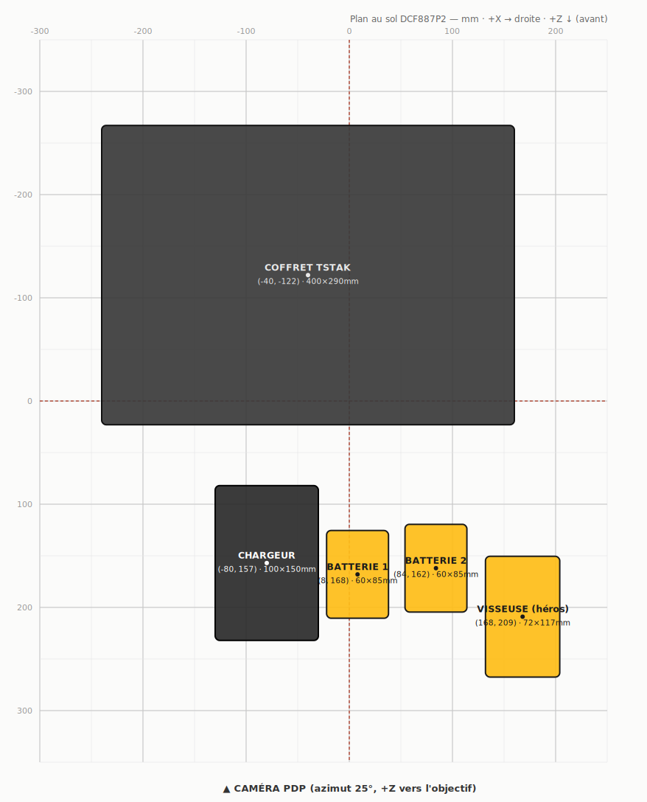

# Plan au sol des packs 3D — gabarit réutilisable

> Carte quadrillée de la disposition **validée** du pack **DCF887P2**
> (« nickel tu peux envoyer », 20/07/2026). Sert de gabarit EXACT pour fusionner
> les prochains packs (DCF894P2, DCF850P2T, DCD796P2…) avec la même composition.
> Toutes les valeurs sont en **millimètres**, extraites automatiquement du
> pipeline (`scratchpad/_gltftools/pack-merge.mjs` → `pack-layout.json`), pas à la main.



## Repère (non négociable pour que la compo tienne)

- La caméra de la fiche produit (`<model-viewer id="pdp3d">`) a une orbite par
  défaut **fixe** ≈ **azimut 25° / polaire 72°** (identique pour TOUS les
  produits — pas d'orbite par produit). On compose donc POUR cette caméra.
- Axes du modèle : **+X → droite**, **+Z → vers l'objectif** (l'avant du pack).
  Sur la carte : +X vers la droite, +Z vers le **bas** (la caméra est en bas).
- **Règle héros** : le produit principal (ici la visseuse) va au **premier plan
  avant-droit** (grand +Z, +X positif) → la perspective le rend le plus gros et
  le plus visible, même s'il est physiquement plus petit que le coffret.
- Coffret **de face** (loquets/étiquette vers la caméra), **reculé** (−Z) et
  légèrement décalé à gauche = arrière-plan.
- Chargeur + batteries en **rangée avant**, regroupés près de la visseuse,
  étalés en X pour qu'**aucun n'en cache un autre**.

## Coordonnées validées (mm) — centre (cx, cz) et emprise au sol (w × dp)

| Composant | rotationY | cx | cz | emprise w×dp | rôle |
|---|---|---:|---:|---|---|
| Coffret TSTAK | 0° (de face) | −40 | −122 | 400 × 290 | arrière-plan |
| Visseuse DCF887N | 0° (chuck gauche, logo DEWALT face) | 168 | 209 | 72 × 117 | **héros** avant-droit |
| Chargeur DCB1104 | 0° | −80 | 157 | 100 × 150 | rangée avant gauche |
| Batterie 1 DCB184 | 90° (**bat_r90**) | 8 | 168 | 60 × 85 | rangée avant centre |
| Batterie 2 DCB184 | 90° (**bat_r90**) | 84 | 162 | 60 × 85 | rangée avant centre-droit |

`cz` négatif = vers l'arrière (loin de la caméra) ; `cz` positif = vers l'avant.
Tous les objets sont **posés au sol** (base à Y=0) et **centrés en XZ** sur (cx, cz).

## Formules paramétriques (pour transposer à un autre pack)

Les positions sont définies **relativement aux dimensions du coffret** (`P.case.w`,
`P.case.dp` après mise à l'échelle et rotation), donc réutilisables tel quel :

```js
const pos = {
  case:    [ -P.case.w*0.10, -P.case.dp*0.42 ],   // de face, reculé, un peu à gauche
  tool:    [  P.case.w*0.42,  P.case.dp*0.72 ],    // HÉROS : premier plan avant-droit
  charger: [ -P.case.w*0.20,  P.case.dp*0.54 ],    // rangée avant, gauche
  bat1:    [  P.case.w*0.02,  P.case.dp*0.58 ],    // rangée avant, centre
  bat2:    [  P.case.w*0.02 + P.bat1.w + 16, P.case.dp*0.56 ],
};
```

Tailles réelles utilisées (mm, `realMax` = plus grande dimension) : coffret **400**,
visseuse **180**, chargeur **150**, batterie **85**. Batteries orientées **bat_r90**
(rotationY = π/2) — position exacte exigée par l'user.

## Recette technique (rappel)

Pipeline `scratchpad/_gltftools/pack-merge.mjs` (gltf-transform) :
`mergeDocuments` + reparent sous un node wrapper + `getBounds`→échelle sur `realMax`
+ rotationY (quaternion) + placement `pos` + **un seul buffer** (contrainte GLB).
Compression : `dedup` + `weld` + `simplify` meshopt **ratio 0.3** (erreur 0,1 %)
+ `draco` + `textureCompress` WebP 512². Cible **≤ 2,5 Mo** (plafond 3 Mo).

Vérification orientation d'un GLB inconnu : `scratchpad/_orient.js <glb>` rend 4
vues à 90° depuis la caméra fiche → choisir la rotationY qui montre la bonne face.
